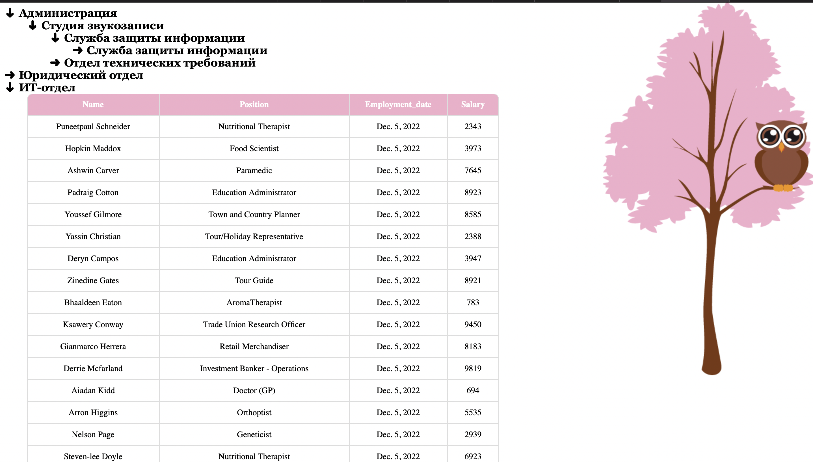
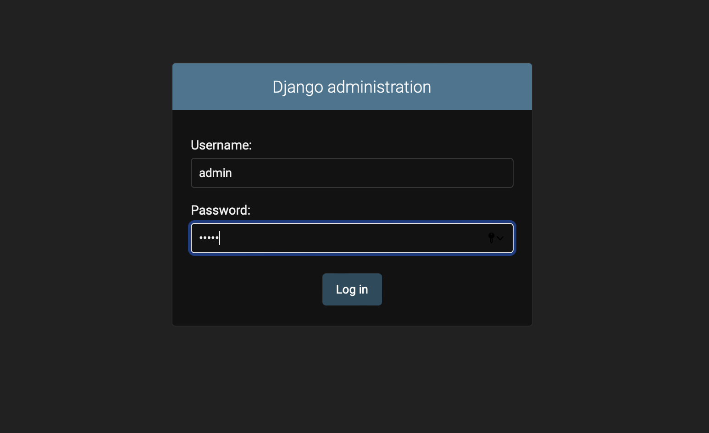
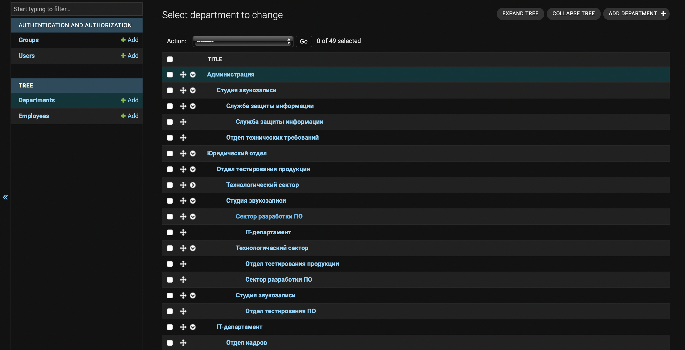
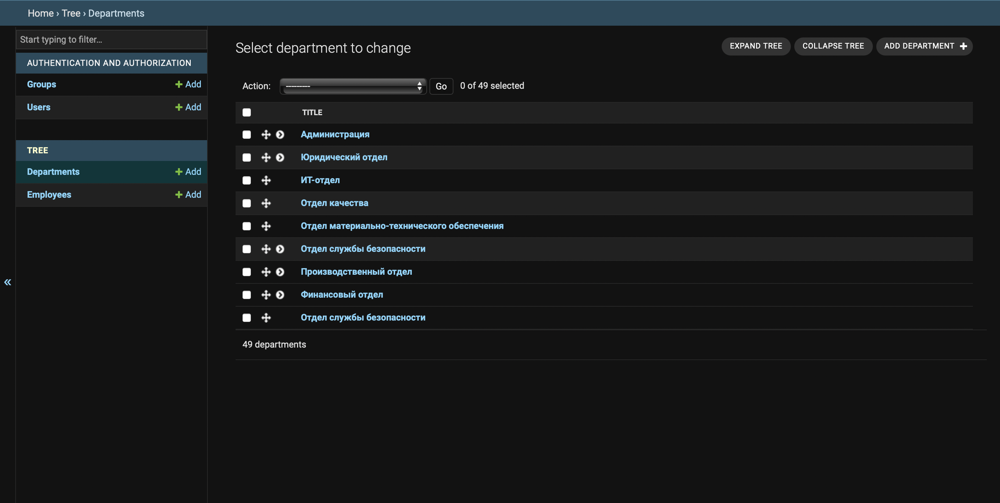
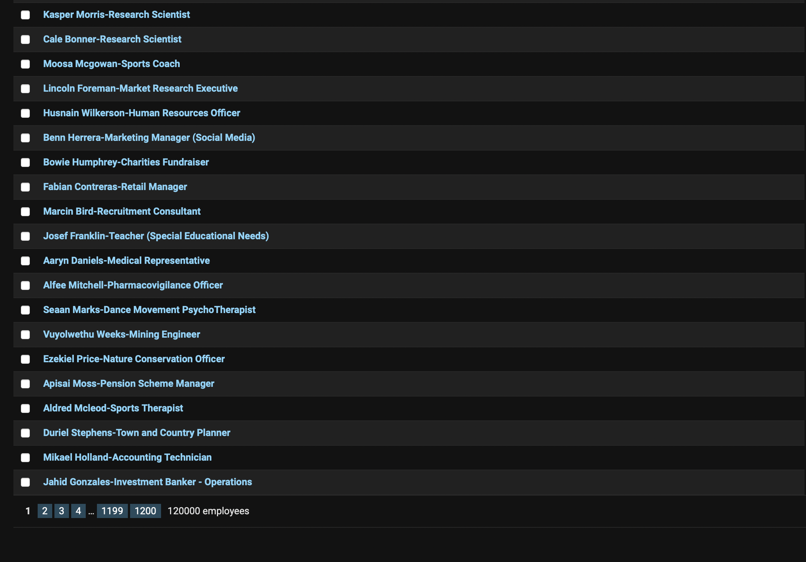

### Installation
- clone git repo 
```
git clone https://github.com/Zharkyn20/employee_tree.git
```
- move to employee_tree
```
cd employee_tree
```
- install requirements
```
pip install -r requirements.txt
```
- make migrations
```
python3 manage.py makemigrations
```
```
python3 manage.py migrate
```
- populate db (randomly creates 50 departments, and more than 100_000 employees)
- also creates superuser with username: 'admin', password: 'admin'
```
python3 manage.py populate
```
- run script
```
python3 manage.py runserver
```
- link to main page

http://127.0.0.1:8000

That will look like this:



- link to admin

http://127.0.0.1:8000/admin/

ADMIN:
Admin login (superuser already exists)
(Username - admin,
Password - admin):



Departments in admin panel


Collapsed departments in admin panel


Employees amount in admin

